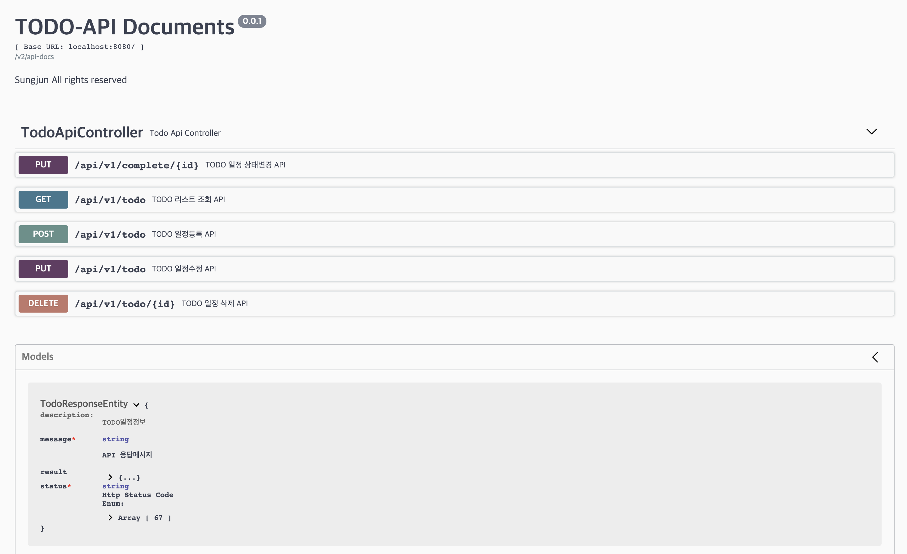
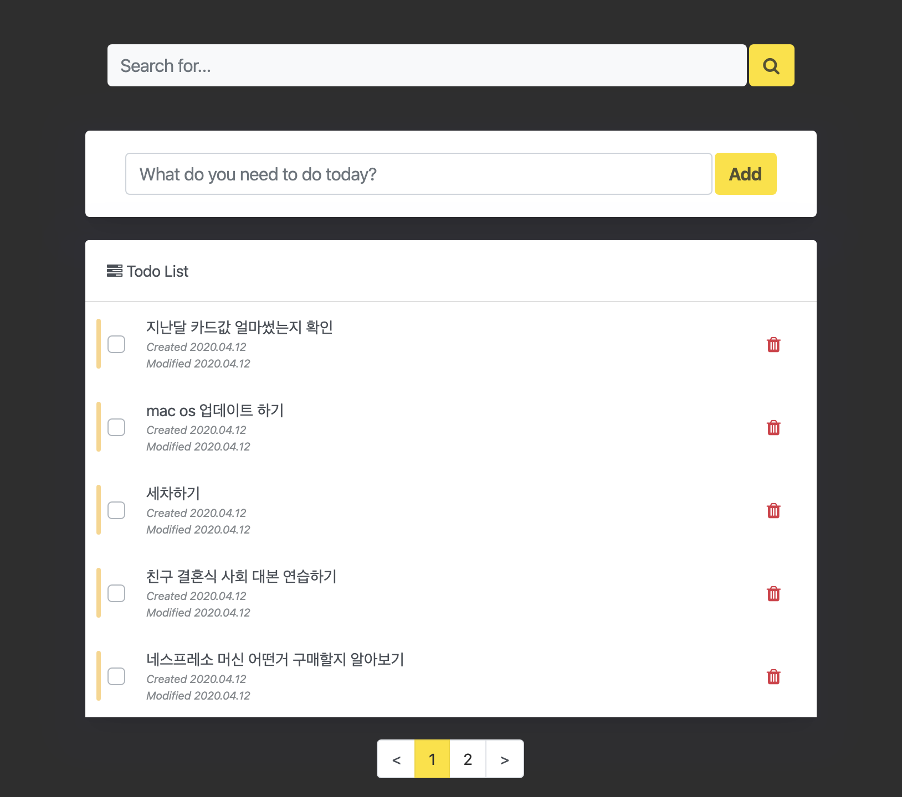
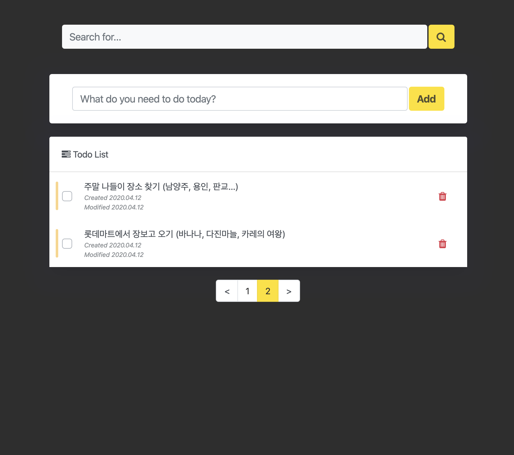
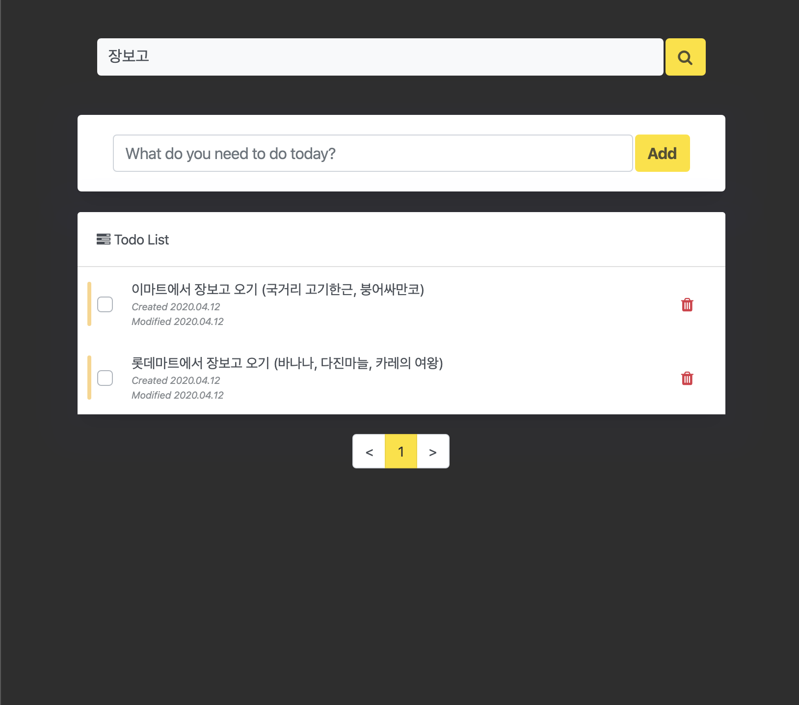
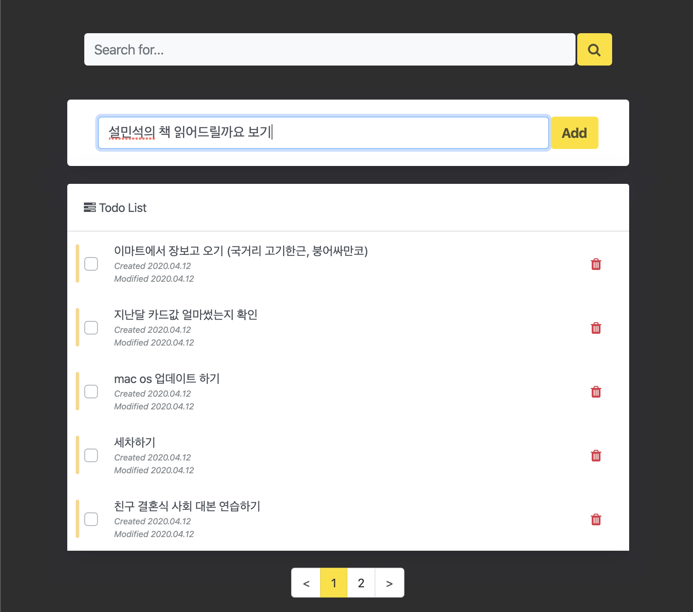
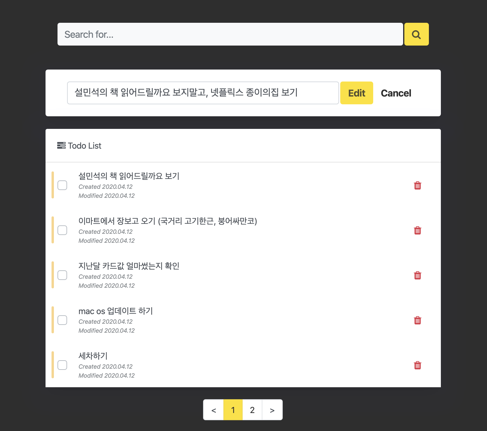
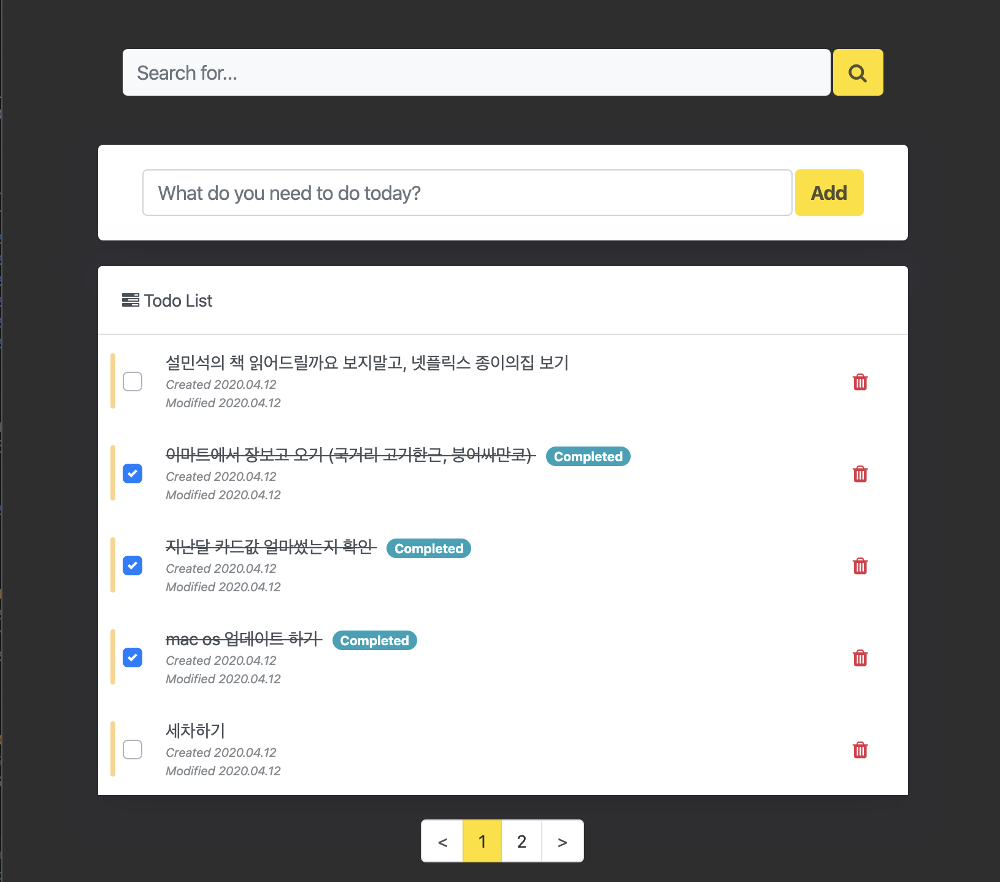

# Todo App
## 1. 개발 스펙
- Frontend
    - Backbone.js
    - Underscore.js
    - RequireJS
    - jQuery
    - Handlebars Template
    - Thymelef
    - Bootstrap
    - Webjar
- Backend
    - Java 1.8
    - Spring Boot 2.1.9
    - Gradle
    - Embed MongoDB
    - Swagger UI
    - Lombok
    - Docker
    - Bash shell (실행 스크립트)


## 2. 주요 기능
- API 문서 확인
    - 접속 URL : [Swagger API Docs](http://localhost:8080/swagger/index.html)
- 단위테스트
    - /todo-app/src/test/java/todoapp/TodoAppApplicationTests.java
- Todo App
    - 접속 URL : [Todo App](http://localhost:8080/)
    - 키워드 검색 (일정내용으로 full like 검색)
    - 일정 조회 (등록된 일정내역 노출, 등록/수정일자, 일정완료여부 노출)
    - 페이징기능 (5건의 일정 단위로 페이징 처리)
    - 일정 추가 (상단 일정 추가영역에서 일정 등록)
    - 일정 수정 (등록된 일정 목록에서 해당 일정 클릭시 상단에서 수정/저장 가능)
    - 일정 삭제 (빨간색 휴지통 클릭)
    - 일정 상태변경 (체크박스 클릭)


## 3. 주요 기능별 스크린샷
| API Documents                                                                                  |
| ---------------------------------------------------------------------------------------------- |
| [](./screenshots/api-docs.png) |


| Todo App 화면소개 (조회결과)                                                                   | Todo App (페이징 조회 : 2번째 페이지)                                                             |
| ------------------------------------------------------------------------------------------ | ------------------------------------------------------------------------------------------ |
| [](./screenshots/screenshot-1.png) | [](./screenshots/screenshot-2.png) |


| Todo App 화면소개 (검색결과)                                                                   | Todo App (일정 등록)                                                                         |
| ------------------------------------------------------------------------------------------ | ------------------------------------------------------------------------------------------ |
| [](./screenshots/screenshot-3.png) | [](./screenshots/screenshot-4.png) |


| Todo App 화면소개 (일정 수정)                                                                      | Todo App (일정 상태변경)                                                                            |
| ---------------------------------------------------------------------------------------------- | ----------------------------------------------------------------------------------------------- |
| [](./screenshots/screenshot-5.png) | [](./screenshots/screenshot-6.png) |


## 4. Todo App Application 실행방법
- 테스트 환경 조건
  - JDK 1.8+ 버전 설치 필요
  - Docker 설치 필요
- 테스트 환경 설정 `(MAC OS 예시)`
- JDK 설치
```bash
brew cask info java
brew cask install java
```
- docker 설치
```bash
# command 설치
$ brew cask install docker

# GUI로 파일 다운로드 설치시 아래 URL에서 다운로드
# https://hub.docker.com/editions/community/docker-ce-desktop-mac/ 
``` 
- check out 받은 깃헙 디렉토리에서 아래 스크립트 파일 수행
- `실행명령어 ./todo-app.sh start` 수행 후 서버가 뜨기까지 수십초 시간이 소요되므로 해당 명령어 수행 후 약 `1분` 이 후 [접속URL](http://localhost:8080) http://localhost:8080 로 접속해 주시기 바랍니다. 
```bash
# Todo App 실행 명령어
$ ./todo-app.sh start
```
```bash
# Todo App 종료 명령어
$ ./todo-app.sh stop
```


## 5. Contact
e-mail : arduous1130@gmail.com